# New-CAPTCHA-System

## 🔍 Background

CAPTCHA (Completely Automated Public Turing test to tell Computers and Humans Apart) systems have long been used as a defense mechanism against automated bots. However, recent advancements in machine learning have made it increasingly easier for AI-powered programs to bypass conventional CAPTCHA mechanisms, including both text-based and image-based CAPTCHAs.

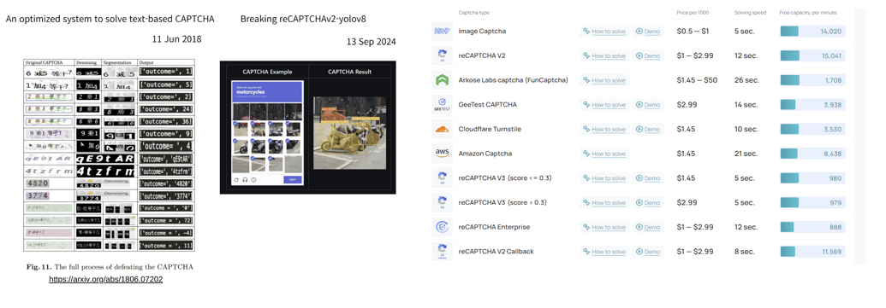

As shown in the image above:
- Traditional CAPTCHA systems such as reCAPTCHA v2 and FunCaptcha have been successfully solved using deep learning techniques.
- For example, character-based CAPTCHA has been defeated via segmentation and denoising pipelines, and even reCAPTCHA v2 image challenges can be broken using object detection models like YOLOv8.
- These breakthroughs enable bots to solve CAPTCHA in under 10 seconds at very low costs, posing a significant security threat.

With the increasing sophistication of these automated solvers, a new form of CAPTCHA is required — one that better exploits the **cognitive gap between humans and machines**.

## 🧠 Our Approach

To address this issue, we propose a **Multi-Modal CAPTCHA system** that leverages:
- Visual reasoning
- Human intuition
- Real-time interaction

Instead of asking users to simply click or type, our system requires users to **draw** or **highlight** semantic regions (e.g., cloud shapes, dangerous objects), which introduces complexity that is **trivial for humans but difficult for machines**.

Our goal is to develop a CAPTCHA system that:
- Adapts to various visual prompts
- Is resistant to automation attacks
- Maintains usability and accessibility for real users
  
## 🧠 Deep Learning Approach

To develop a CAPTCHA system that cannot be easily defeated by automated bots, we designed a novel pipeline involving generative and discriminative deep learning models.

### 1️⃣ Image Generation with DCGAN

We employed a **DCGAN (Deep Convolutional GAN)** architecture to generate realistic but ambiguous images. These images are:
- Visually confirmable by humans.
- Diverse in representation (no mode collapse).
- Difficult for machines to categorize with high certainty.

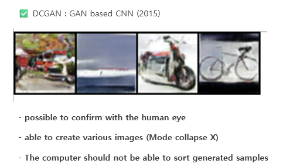

> ✅ The goal: Humans can intuitively classify these images, but machines cannot reliably sort or label them.

---

### 2️⃣ Evaluation using ResNet18 Classifier

To validate the effectiveness of our generated CAPTCHA images, we conducted an evaluation using **ResNet18**, a well-known image classification model.

- The ResNet18 model was fine-tuned on the original dataset with high accuracy (~47% F1-score).
- When tested on a **grid of GAN-generated samples**, the model’s F1-score **dropped significantly to 12%**, indicating that:
  - The generated samples do not align well with known class distributions.
  - Machines struggle to infer semantic meaning from our synthesized data.

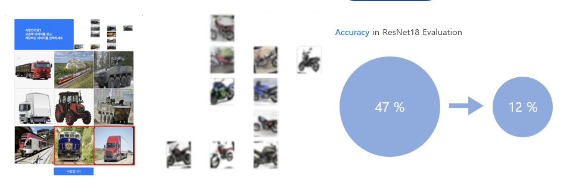

This demonstrates that our CAPTCHA system leverages the **cognitive gap between human and machine perception**, successfully degrading model confidence while maintaining human interpretability.

### 2️⃣ Cognitive Illusion-Based CAPTCHA with Diffusion Models

In addition to GAN-generated visuals, we developed an advanced CAPTCHA mechanism based on **Illusion Diffusion**, a recent variant of Stable Diffusion that leverages perceptual ambiguity to confuse automated recognition systems.

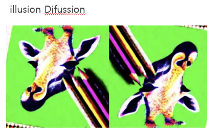

We intentionally generated images that exhibit **mirrored or illusory structures**, which are easily distinguishable by humans but introduce significant confusion to machine vision models.

---

### 🔍 Benchmarking Against SAM and YOLOv11

To evaluate the difficulty of our CAPTCHA images from a machine learning standpoint, we tested them against:
- **SAM (Segment Anything Model)** for object-level segmentation.
- **YOLOv11** for object classification and detection.

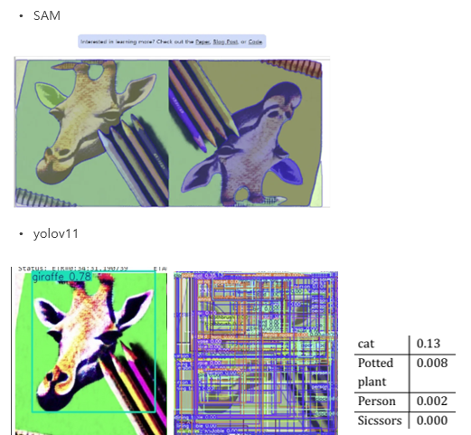

While SAM was able to segment the object contours, and YOLOv11 attempted classification, the models:
- **Failed to correctly classify target objects like "giraffe" or "penguin"** in many scenarios.
- Showed **confused logits across unrelated classes** such as "cat", "potted plant", or "scissors".
- Generated bounding boxes that often missed key regions.

This reinforces our hypothesis that **humans can still intuitively identify the right patterns**, while **machines lack the semantic context to succeed**.

---

### 🧪 Human-in-the-Loop CAPTCHA Example

Below is an example from our system where users are asked to **select all images containing erasers**, while the reference image above is based on Illusion Diffusion outputs.

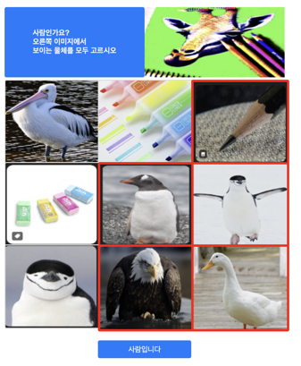

This interactive format ensures:
- High accuracy from genuine human users.
- Low success rates for automated bots and model-based solvers.
## 🎨 Multi-Dimensional CAPTCHA: Drawing-Based Interaction

As our third method, we propose a **Multi-Dimensional CAPTCHA** system that challenges users to interact with AI-generated images in a more semantically demanding way — by drawing or highlighting specific objects within the image.

---

### 🖼️ Image Generation via Stable Diffusion

We utilize **Stable Diffusion** with carefully designed prompts to synthesize high-quality images featuring specific semantic elements such as:
- Fluffy clouds
- Cotton candy
- Chimney smoke

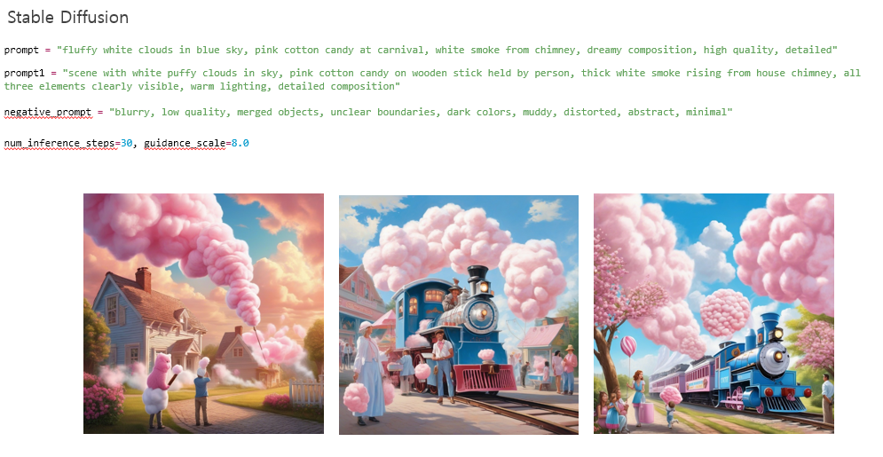

These prompts allow for the creation of scenes that are rich in content but visually similar across object types — increasing difficulty for automated solvers while maintaining intuitive understanding for humans.

---

### 🧠 The Multi-Modal Challenge

Users are prompted with tasks like:

> "Please highlight the clouds in the image below."

Then, using a mouse or touch interface, users **draw directly on the image** to identify the target region.

On the backend:
- We employ a **Vision-Language Model (VLM)** to interpret the prompt.
- A model like **SAM (Segment Anything Model)** generates segmentation masks of the image.
- However, selecting the correct mask for the queried class (e.g., “cloud”) requires resolving **vision-language alignment**, which is still a challenge for machines.

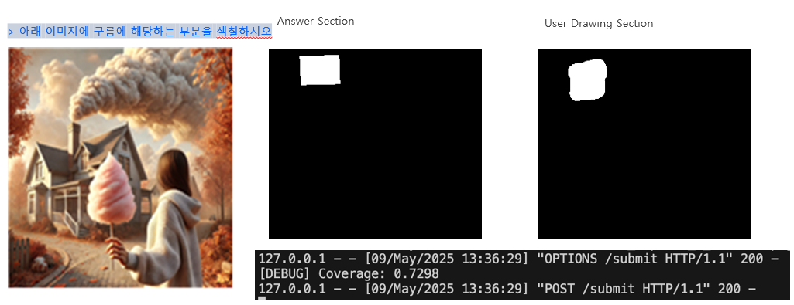

---

### ✅ Security & Effectiveness

This system is effective because:

- 🔒 **Hard for Bots**: It’s difficult for an automated system to draw the correct region without understanding the prompt and visual content together.
- 👤 **Easy for Humans**: Humans naturally perceive visual objects and semantic meaning, allowing them to perform the task with ease.
- 🧪 **Robust Evaluation**: We compare the user-drawn mask with the ground truth mask and compute IoU (Intersection over Union) to determine success.

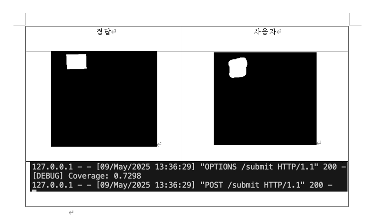

This **multi-dimensional approach** highlights the cognitive advantage humans have over machines, making our CAPTCHA system not only secure, but also adaptable to real-world semantic reasoning.

## 🧱 System Architecture & API Deployment

Our CAPTCHA platform is designed to be modular, scalable, and cloud-deployable. The entire system is containerized via **Docker** and structured for deployment on cloud services such as **AWS**. Below is the architecture diagram illustrating the core components and data flow:

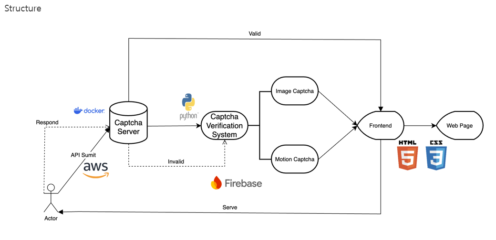

---

### 🧩 Architecture Breakdown

1. **Actor (User/Client)**
   - Initiates a CAPTCHA request by accessing a webpage or submitting an API call.

2. **Captcha Server (Dockerized)**
   - Runs as a microservice container.
   - Handles requests via an exposed API endpoint.
   - Sends responses depending on the CAPTCHA challenge (image/motion-based).

3. **Captcha Verification System**
   - Built in **Python**.
   - Receives the user’s interaction (drawn region, selected object, etc.).
   - Verifies whether the response is correct using methods such as:
     - IoU calculation
     - Prompt-to-segmentation mask matching
     - CLIP-based semantic scoring

4. **Firebase (optional)**
   - Manages invalid responses, session storage, and user tracking for additional logging or behavior-based modeling.

5. **CAPTCHA Types**
   - **Image CAPTCHA**: Still-image classification or drawing challenges.
   - **Motion CAPTCHA**: Drawing over time or dynamic object tracking.

6. **Frontend**
   - Built using **HTML5** and **CSS3**.
   - Presents the challenge to the user.
   - Communicates results with the backend API.

7. **Web Page Delivery**
   - Final CAPTCHA-enabled pages served to users through the browser.

---

### ☁️ Deployment Plan

We have containerized the CAPTCHA system using **Docker** and plan to deploy it using **AWS EC2** or **AWS Lambda with API Gateway**, allowing scalable integration into third-party services.

- ✅ Docker Image: Built & tested
- ✅ API Integration: `/submit`, `/verify`, `/generate`
- 🔜 AWS Deployment: In progress (target: production-ready endpoint)

This design ensures **flexibility for developers**, **security against bot automation**, and **efficient scaling via cloud platforms**.

## 🛠 Developer Portal & API Key Management

To make our CAPTCHA system easily accessible to third-party developers, we built a **dedicated Developer Web Portal** that enables API key issuance, application management, and real-time usage tracking.

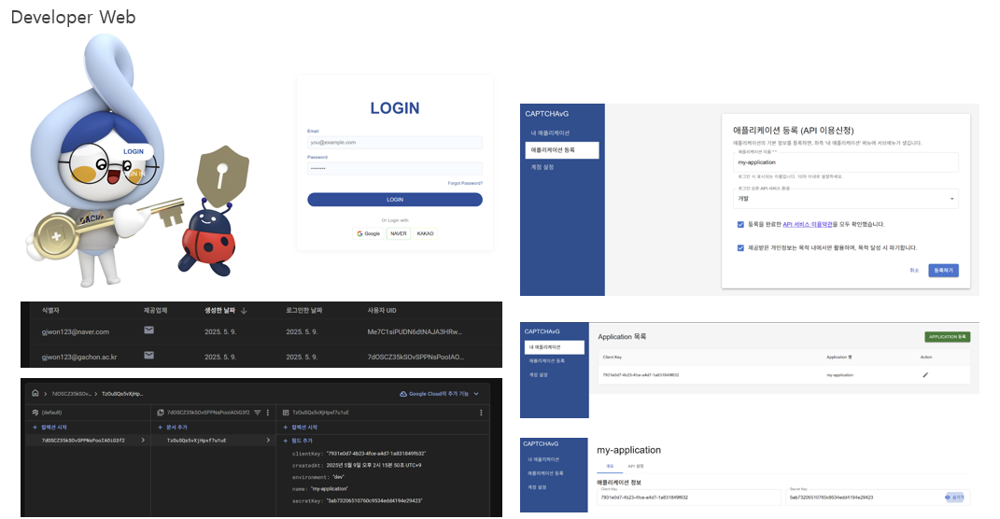

---

### 🌐 Key Features

1. **Secure Login**
   - Supports email/password login or social login via Google, Naver, and Kakao.

2. **Application Registration**
   - Developers can register their application by specifying the name and use-case (e.g., "Web", "Mobile", "Game").
   - Upon registration, a **Client Key** and **Secret Key** are automatically generated.

3. **API Console**
   - View active keys, creation dates, and application metadata.
   - Supports integration with **Google Firebase** or custom backend systems.

4. **API Management**
   - Enables developers to:
     - Generate or revoke API keys
     - Access endpoint documentation
     - Test CAPTCHA services in real time

---

### 🔑 Example Flow

1. User logs in with `your@email.com`
2. Registers an app named `"my-application"`
3. Receives:
   - `clientKey`: `791c6d7-...`
   - `secretKey`: `5a79205b09f...`
4. Uses these keys to make authenticated POST requests to CAPTCHA verification APIs.

This portal simplifies **integration, testing, and management** of our CAPTCHA system — allowing developers to focus on their product while ensuring robust protection against bots.

